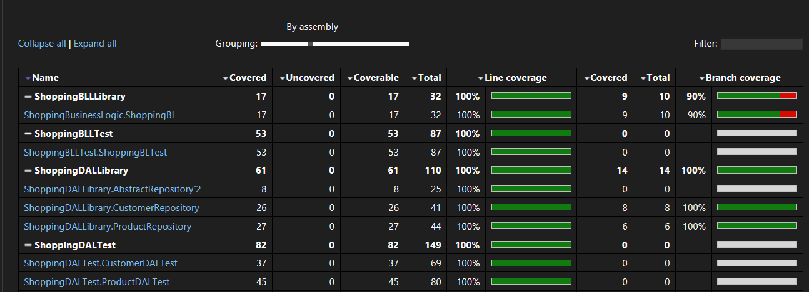

## Tasks

1. Complete the repository for Product, Cart, and Cart Items.

2. Unit test your repositories.

3. Create Business logic for the shopping app:
   - Rules as follows:
     - All purchases below 100 will be charged a shipping charge of Rs. 100.
     - If the purchase has only 3 items and has an order value of 1500, provide a 5% discount.
     - The maximum quantity of a product in the cart cannot be more than 5.

4. Unit test your Business Logic.

## Result

1. Completed the repository for Product, Cart, and Cart Items.
2. Completed the unit test for repositories.
3. Created Business logic for the shopping app.
4. Completed the unit test for Business Logic.

## Screenshots

