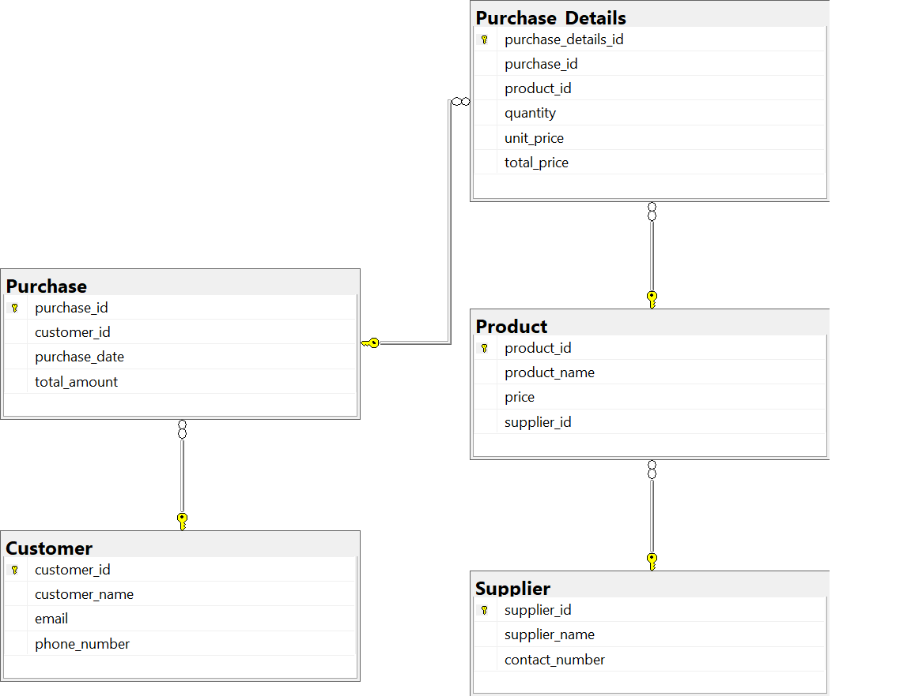
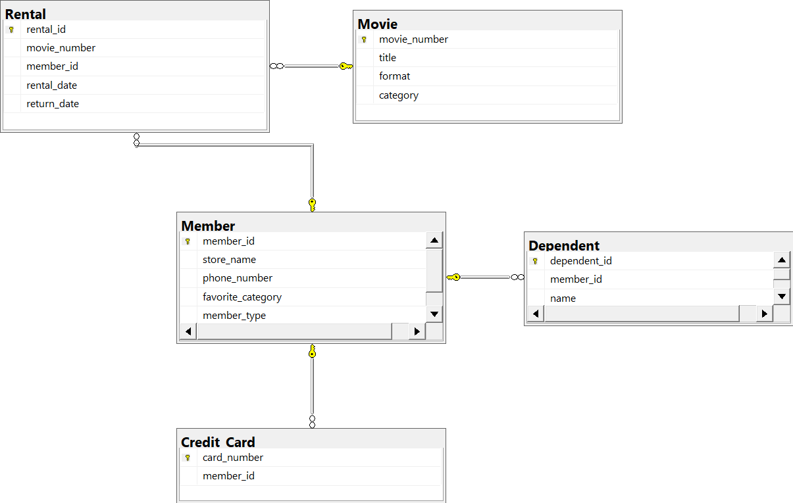
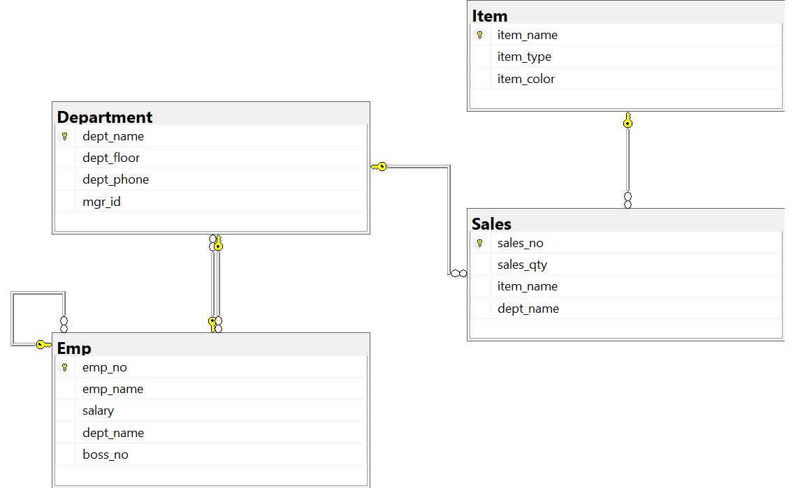

## Question - 1

Design the database for a shop which sells products

**Points for consideration:**
1. One product can be supplied by many suppliers
2. One supplier can supply many products
3. All customer details have to be present
4. A customer can buy more than one product in every purchase
5. Bill for every purchase has to be stored
6. These are just details of one shop

*Note: You do not have to store the shop details.*

ER Diagram for the above Question:


---

## Question - 2

**Case 1: A Simple Case on ER Modeling**

**Goal:** To demonstrate how to build an E-R model from a simple Statement of Objectives of a movie store (given very clearly in statement forms).

**Scenario:**
- A video store rents movies to members.
- Each movie in the store has a title and is identified by a unique movie number.
- A movie can be in VHS, VCD, or DVD format.
- Each movie belongs to one of a given set of categories (action, adventure, comedy, ... ).
- The store has a name and a (unique) phone number for each member.
- Each member may provide a favorite movie category (used for marketing purposes).
- There are two types of members:
  - Golden Members
  - Bronze Members
- Golden members can rent one or more movies using their credit cards, while bronze members can rent a maximum of one movie.
- A member may have a number of dependents (with known names).
- Each dependent is allowed to rent one (1) movie at a time.

ER Diagram for the above Question:


---

## Question - 3

***Create Tables with Integrity Constraints:***

***Table Schema***
a) EMP
- empno (primary key)
- empname
- salary
- deptname (foreign key references entries in deptname of department table with null constraint)
- bossno (foreign key references entries in empno of emp table with null constraint)

b) DEPARTMENT
- deptname (primary key)
- floor
- phone
- empno (foreign key references entries in empno of emp table not null)

c) SALES
- salesno (primary key)
- saleqty
- itemname (foreign key references entries in itemname of item table with not null constraint)
- deptname (foreign key references entries in deptname of department table with not null constraint)

d) ITEM
- itemname (primary key)
- itemtype
- itemcolor

SQL CODE for the above schema:

```sql
-- Create Company database
CREATE DATABASE CompanyDB;

-- Use Company database
USE CompanyDB;

-- Create Emp table
CREATE TABLE Emp (
    emp_no INT IDENTITY(1,1) CONSTRAINT pk_emp_id PRIMARY KEY,
    emp_name VARCHAR(20),
    salary FLOAT,
    dept_name VARCHAR(20),
    boss_no INT
);

-- Create Department table
CREATE TABLE Department (
    dept_name VARCHAR(20) CONSTRAINT pk_dept_name PRIMARY KEY,
    dept_floor INT,
    dept_phone VARCHAR(10),
    mgr_id INT CONSTRAINT fk_emp_no FOREIGN KEY REFERENCES EMP(emp_no) NOT NULL
);

-- Alter references in Emp table for department
ALTER TABLE Emp 
ADD CONSTRAINT fk_dept_name FOREIGN KEY (dept_name) REFERENCES Department(dept_name);

-- Alter references in Emp table for boss number
ALTER TABLE Emp
ADD CONSTRAINT fk_boss_no FOREIGN KEY (boss_no) REFERENCES Emp(emp_no);

-- Create Item table
CREATE TABLE Item (
    item_name VARCHAR(30) CONSTRAINT pk_item_name PRIMARY KEY,
    item_type VARCHAR(5), 
    item_color VARCHAR(20)
);

-- Create Sales table
CREATE TABLE Sales (
    sales_no INT IDENTITY(100, 1) CONSTRAINT pk_sales_no PRIMARY KEY,
    sales_qty INT,
    item_name VARCHAR(30) NOT NULL,
    dept_name VARCHAR(20) NOT NULL,
    CONSTRAINT fk_dept_name_in_Sales FOREIGN KEY (dept_name) REFERENCES Department(dept_Name),
    CONSTRAINT fk_Item_name_in_Sales FOREIGN KEY (Item_name) REFERENCES Item(item_name)
);

-- Insert data into Emp table 
INSERT INTO Emp (emp_name, salary) VALUES 
('Alice', 75000),
('Ned', 45000),
('Andrew', 25000),
('Clare', 22000),
('Todd', 38000),
('Nancy', 22000),
('Brier', 43000),
('Sarah', 56000),
('Sophie', 35000),
('Sanjay', 15000),
('Rita', 15000),
('Gigi', 16000),
('Maggie', 11000),
('Paul', 15000),
('James', 15000),
('Pat', 15000),
('Mark', 15000);

-- Insert data into Department table
INSERT INTO Department VALUES
('Management', 5, '34', 1),
('Books', 1, '81', 4),
('Clothes', 2, '24', 4),
('Equipment', 3, '57', 3),
('Furniture', 4, '14', 3),
('Navigation', 1, '41', 3),
('Recreation', 2, '29', 4),
('Accounting', 5, '35', 5),
('Purchasing', 5, '36', 7),
('Personnel', 5, '37', 9),
('Marketing', 5, '38', 2);

-- Insert data into Item table
INSERT INTO Item (item_name, item_type, item_color) VALUES
('Pocket Knife-Nile', 'E', 'Brown'),
('Pocket Knife-Avon', 'E', 'Brown'),
('Compass', 'N', NULL),
('Geo positioning system', 'N', NULL),
('Elephant Polo stick', 'R', 'Bamboo'),
('Camel Saddle', 'R', 'Brown'),
('Sextant', 'N', NULL),
('Map Measure', 'N', NULL),
('Boots-snake proof', 'C', 'Green'),
('Pith Helmet', 'C', 'Khaki'),
('Hat-polar Explorer', 'C', 'White'),
('Exploring in 10 Easy Lessons', 'B', NULL),
('Hammock', 'F', 'Khaki'),
('How to win Foreign Friends', 'B', NULL),
('Map case', 'E', 'Brown'),
('Safari Chair', 'F', 'Khaki'),
('Safari cooking kit', 'F', 'Khaki'),
('Stetson', 'C', 'Black'),
('Tent - 2 person', 'F', 'Khaki'),
('Tent -8 person', 'F', NULL);

-- Insert data into SALES table
INSERT INTO Sales (sales_qty, item_name, dept_name) VALUES
(2, 'Boots-snake proof', 'Clothes'),
(1, 'Pith Helmet', 'Clothes'),
(1, 'Sextant', 'Navigation'),
(3, 'Hat-polar Explorer', 'Clothes'),
(5, 'Pith Helmet', 'Equipment'),
(2, 'Pocket Knife-Nile', 'Clothes'),
(3, 'Pocket Knife-Nile', 'Recreation'),
(1, 'Compass', 'Navigation'),
(2, 'Geo positioning system', 'Navigation'),
(5, 'Map Measure', 'Navigation'),
(1, 'Geo positioning system', 'Books'),
(1, 'Sextant', 'Books'),
(3, 'Pocket Knife-Nile', 'Books'),
(1, 'Pocket Knife-Nile', 'Navigation'),
(1, 'Pocket Knife-Nile', 'Equipment'),
(1, 'Sextant', 'Clothes'),
(1, 'Exploring in 10 easy lessons', 'Books'),
(1, 'Camel Saddle', 'Recreation');
```

ER Diagram for the above Question:

