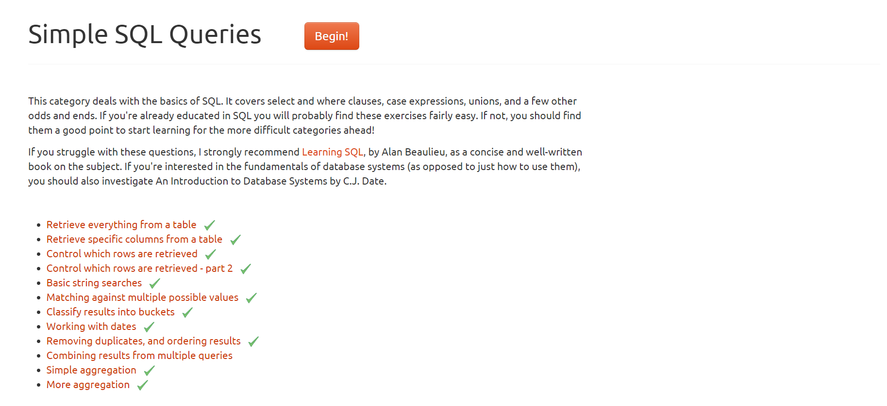

## SQL - Practice

```sql
-- Use the NorthWind database
USE NorthWind;

-- Basic selects
SELECT * FROM Products;
SELECT ProductName, QuantityPerUnit FROM Products;
SELECT ProductName AS Name_Of_Product, QuantityPerUnit AS Quantity_Per_Unit FROM Products;
SELECT ProductName AS 'Name Of Product', QuantityPerUnit AS Quantity_Per_Unit FROM Products;

-- Filtering based on conditions
SELECT * FROM Products WHERE UnitPrice > 10;
SELECT * FROM Products WHERE UnitsInStock = 0;
SELECT * FROM Products WHERE Discontinued = 1;
SELECT * FROM Products WHERE Discontinued = 1 AND UnitsInStock > 0;
SELECT * FROM Products WHERE UnitPrice > 10 AND UnitPrice < 30;
SELECT * FROM Products WHERE UnitPrice BETWEEN 10 AND 30;

-- Select with calculated columns
SELECT ProductName, UnitPrice AS Price, UnitsInStock, (UnitPrice * UnitsInStock) AS "Amount worth" FROM Products;
SELECT ProductName, UnitPrice AS Price, UnitsInStock, (UnitPrice * UnitsInStock) AS "Amount worth" FROM Products WHERE CategoryID = 3;

-- Pattern matching
SELECT * FROM Products WHERE QuantityPerUnit LIKE '%boxes%'; -- Any number of characters before and after boxes
SELECT * FROM Products WHERE QuantityPerUnit LIKE '__ Boxes'; -- First two characters are any characters and then Boxes

-- Aggregation
SELECT SUM(UnitsInStock) AS "Stock of products in category 3" FROM Products WHERE CategoryID = 3;
SELECT AVG(UnitPrice) AS "Average Price" FROM Products WHERE SupplierID = 2;
SELECT SUM(UnitsInStock * ReorderLevel) AS "Expected amount to be paid" FROM Products;
SELECT CategoryId, SUM(UnitsInStock) AS 'Stock Available' FROM Products GROUP BY CategoryId;
SELECT SupplierID, COUNT(ProductName) AS Number_Of_Products, SUM(UnitsInStock) AS 'Items in stock', AVG(UnitPrice) AS 'Average Price' FROM Products GROUP BY SupplierID;

-- Grouping with HAVING clause
SELECT SupplierID, CategoryId, AVG(UnitPrice) AS Average_Price FROM Products GROUP BY CategoryId, SupplierId HAVING AVG(UnitPrice) > 15;

-- Ordering
SELECT CategoryID, COUNT(ProductName) AS 'Count of Products' FROM Products GROUP BY CategoryID HAVING COUNT(ProductName) > 10;
SELECT * FROM Products ORDER BY CategoryID, SupplierID, ProductName;
SELECT * FROM Products ORDER BY ProductName;
SELECT ProductName, UnitPrice FROM Products WHERE UnitPrice > 15 ORDER BY CategoryId;
SELECT * FROM Products WHERE Discontinued = 1 ORDER BY UnitPrice;
SELECT CategoryId, SUM(UnitPrice) AS 'Total Price' FROM Products WHERE Discontinued != 1 GROUP BY CategoryId ORDER BY CategoryId;
SELECT CategoryId, SUM(UnitPrice) AS 'Total Price' FROM Products WHERE Discontinued != 1 GROUP BY CategoryId HAVING SUM(UnitPrice) > 200 ORDER BY 1 DESC;
SELECT * FROM Products ORDER BY UnitPrice DESC;
SELECT ProductName, RANK() OVER (ORDER BY UnitPrice DESC) AS "Price Rank" FROM Products;

```

## Tasks

***Question - 1***

https://pgexercises.com/questions/basic/



---

***Question - 2***

1. Print all the titles names

2. Print all the titles that have been published by 1389

3. Print the books that have price in rangeof 10 to 15

4. Print those books that have no price

5. Print the book names that strat with 'The'

6. Print the book names that do not have 'v' in their name

7. print the books sorted by the royalty

8. print the books sorted by publisher in descending then by types in asending then by price in descending

9. Print the average price of books in every type

10. print all the types in uniques

11. Print the first 2 costliest books

12. Print books that are of type business and have price less than 20 which also have advance greater than 7000

13. Select those publisher id and number of books which have price between 15 to 25 and have 'It' in its name. Print only those which have count greater than 2. Also sort the result in ascending order of count

14. Print the Authors who are from 'CA'

15. Print the count of authors from every state

**_Solution:_**

```sql
-- Use the 'pubs' database
USE pubs;

-- Print all the titles' names
SELECT title FROM titles;

-- Print all the titles that have been published by '1389'
SELECT title FROM titles
WHERE pub_id = 1389;

-- Print the books that have a price in the range of $10 to $15
SELECT title FROM titles
WHERE price BETWEEN 10 AND 15;

-- Print those books that have no listed price
SELECT title FROM titles
WHERE price IS NULL;

-- Print the book names that start with 'The'
SELECT title FROM titles
WHERE title LIKE 'The%';

-- Print the book names that do not contain the letter 'v'
SELECT title FROM titles
WHERE title NOT LIKE '%v%';

-- Print the books sorted by royalty in descending order
SELECT title FROM titles
ORDER BY royalty DESC;

-- Print the books sorted by publisher in descending order, then by type in ascending order, then by price in descending order
SELECT title FROM titles
ORDER BY pub_id DESC, type ASC, price DESC;

-- Print the average price of books in each type
SELECT type, AVG(price) AS 'Average Price' FROM titles
GROUP BY type;

-- Print all unique types of books
SELECT DISTINCT type FROM titles;

-- Print the first 2 most expensive books
SELECT TOP 2 title, price
FROM titles
ORDER BY price DESC;

-- Print books that are of type 'business', have a price less than $20, and have an advance greater than $7000
SELECT title FROM titles
WHERE type = 'business' AND price < 20 AND advance > 7000;

-- Select the publisher IDs and the number of books which have a price between $15 to $25 and contain 'It' in the title.
-- Print only those with a count greater than 2. Also, sort the result in ascending order of the count.
SELECT pub_id, COUNT(pub_id) AS 'Number of Books' FROM titles
WHERE price BETWEEN 15 AND 25 AND title LIKE '%It%'
GROUP BY pub_id
HAVING COUNT(pub_id) > 2
ORDER BY COUNT(pub_id);

-- Print the authors who are from 'CA'
SELECT au_fname FROM authors
WHERE state = 'CA';

-- Print the count of authors from every state
SELECT state, COUNT(au_id) AS 'Author Count' FROM authors
GROUP BY state;

```
