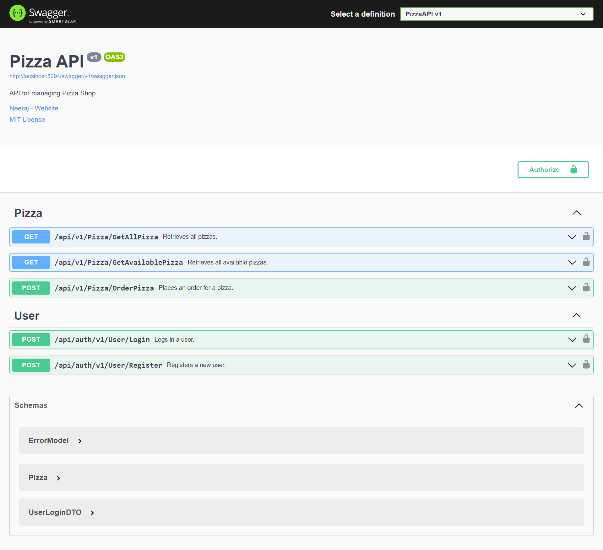

# Pizza API

This API documentation provides details about managing a Pizza Shop. Below are the endpoints available along with their descriptions.

---

## Endpoints:

1. **GET /api/v1/Pizza/GetAllPizza**

   - **Description:** Retrieves all pizzas.
   - **Response:** 
     - 200: Success
       - Content-Type: text/plain, application/json, text/json
       - Schema:
         ```json
         [
           {
             "id": "integer",
             "name": "string",
             "price": "integer",
             "isAvailable": "boolean"
           }
         ]
         ```

2. **GET /api/v1/Pizza/GetAvailablePizza**

   - **Description:** Retrieves all available pizzas.
   - **Response:** 
     - 200: Success
       - Content-Type: text/plain, application/json, text/json
       - Schema:
         ```json
         [
           {
             "id": "integer",
             "name": "string",
             "price": "integer",
             "isAvailable": "boolean"
           }
         ]
         ```

3. **POST /api/v1/Pizza/OrderPizza**

   - **Description:** Places an order for a pizza.
   - **Parameters:**
     - id (query) - integer (int32)
   - **Response:** 
     - 200: Success
       - Content-Type: text/plain, application/json, text/json
       - Schema:
         ```json
         {
           "id": "integer",
           "name": "string",
           "price": "integer",
           "isAvailable": "boolean"
         }
         ```

4. **POST /api/auth/v1/User/Login**

   - **Description:** Logs in a user.
   - **Request Body:** UserLoginDTO
   - **Response:** 
     - 200: Success
       - Content-Type: text/plain, application/json, text/json
       - Schema:
         ```json
         {
           "access_token": "string",
           "token_type": "string",
         }
         ```
     - 401: Unauthorized
       - Content-Type: text/plain, application/json, text/json
       - Schema:
         ```json
         {
           "errorCode": "integer",
           "message": "string"
         }
         ```

5. **POST /api/auth/v1/User/Register**

   - **Description:** Registers a new user.
   - **Request Body:** UserLoginDTO
   - **Response:** 
     - 200: Success
       - Content-Type: text/plain, application/json, text/json
       - Schema:
         ```json
         {
           "type": "string"
         }
         ```
     - 400: Bad Request
       - Content-Type: text/plain, application/json, text/json
       - Schema:
         ```json
         {
           "errorCode": "integer",
           "message": "string"
         }
         ```

---

### Screenshots



